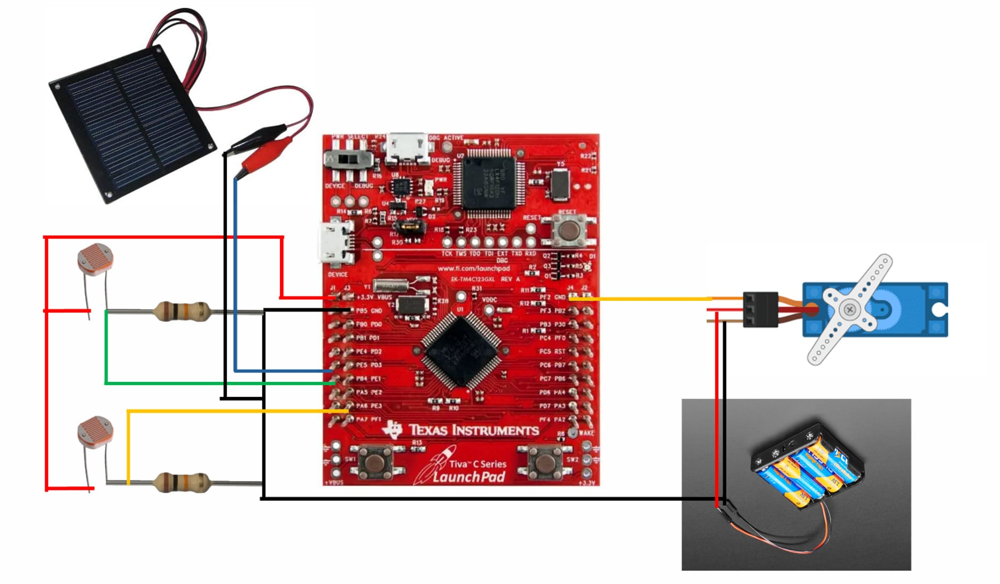

# Automatic Solar Tracker 

**ELEC4020** - **Embedded System**  
Final Project: Automatic Solar Tracker

## Overview  
This project implements a single-axis solar tracker system. The system utilizes ADC modules to read and process data from light-dependent resistors (LDRs), enabling precise adjustment of the servo motor's rotation angle via a PWM signal to optimize solar panel positioning..

## Group members
- Tran Huy Hoang Anh 
- Chu Ha Linh
- Anh Quan Pham  

## Wiring diagram
<!--  -->

## Pins Assignments
- ADC Pins: Connect two LDRs to pins PE3 and PE4.
- PWM Output: Connect the servo motor to pin PF2.

Create your own setup by modifying config variables in [control_motor.c](control_motor.c) and [read_sensors.c](read_sensors.c)

## Documentations
- [Project proposal](docs/Embedded_Project_Proposal.pdf)

